# Вопросы и ответы для подготовки к экзамену

## Содержание

- [Тема 10. Настройка сети в Linux](#theme-10)
- [Тема 11. Настройка окружения Python](#theme-11)
- [Тема 12. Git и GitHub](#theme-12)
- [Тема 13. Сокеты и HTTP](#theme-13)
- [Тема 14. Асинхронность, потоки и процессы](#theme-14)
- [Тема 15. Безопасность сетевых приложений](#theme-15)
- [Тема 16. Веб-сервер](#theme-16)
- [Тема 17. Развертывание приложений](#theme-17)

<a id="theme-10"></a>

## Тема 10. Настройка сети в Linux


### 1. Частные и публичные IP-адреса

**Вопрос**

Объясните различие между частными и публичными IP-адресами, укажите диапазоны частных адресов IPv4, поясните, почему подключение через `NAT` обычно уменьшает доступность компьютера извне и поэтому обычно безопаснее прямого подключения к Интернету.

**Еще один вариант вопроса**

Поясните, как определить, является ли адрес компьютера частным или публичным, какие диапазоны частных IPv4 нужно учитывать, как по этому признаку сделать вывод о возможном использовании `NAT`.

> **Подумайте:** Сначала назовите три частных диапазона IPv4, затем объясните, что NAT делает с внутренним адресом.

<details>
<summary><strong>Показать ответ и объяснение</strong></summary>

**Схема**

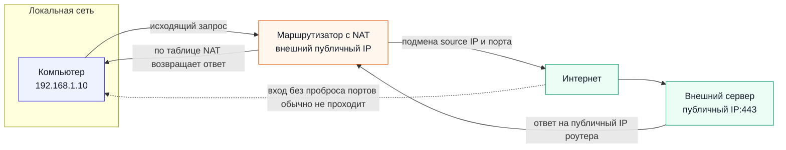

**Краткий ответ**

Частный IPv4-адрес используется внутри локальной сети и не маршрутизируется напрямую как обычный публичный адрес в Интернете. Публичный IP-адрес может использоваться для связи через Интернет, если это не ограничено правилами сети.

| Вид адреса | Диапазон или признак | Где используется |
|---|---|---|
| Частный IPv4 | `10.0.0.0/8` | локальные сети |
| Частный IPv4 | `172.16.0.0/12` (`172.16.0.0`–`172.31.255.255`) | локальные сети |
| Частный IPv4 | `192.168.0.0/16` | локальные сети |
| Публичный IPv4 | не входит в частные диапазоны и не относится к специальным служебным диапазонам | Интернет |

**Объяснение**

- Если компьютер имеет частный адрес, он обычно выходит в Интернет через маршрутизатор с `NAT`.
- `NAT` заменяет внутренний адрес компьютера на внешний публичный адрес маршрутизатора.
- Поэтому внешний узел обычно не может сам начать соединение с внутренним компьютером без проброса портов или другого специального правила.
- Это уменьшает прямую доступность устройства извне, но не заменяет firewall, обновления и безопасную настройку служб.

**Пример**

| Адрес | Тип | Почему |
|---|---|---|
| `192.168.1.10` | частный | входит в `192.168.0.0/16` |
| `172.20.5.7` | частный | входит в `172.16.0.0/12` |
| `8.8.8.8` | публичный | не входит в частные диапазоны |

**Как ответить на экзамене**

> Частные адреса применяются внутри локальной сети. Для выхода в Интернет они часто используют `NAT`, поэтому внутренний компьютер обычно не доступен извне напрямую. Публичный адрес, наоборот, может быть маршрутизирован в Интернете.

**Важно**

- Не весь диапазон `172.*.*.*` является частным. Частный только диапазон `172.16.0.0`–`172.31.255.255`.

</details>

### 2. Модель OSI

**Вопрос**

Раскройте назначение модели OSI, перечислите семь уровней модели, объясните, на каких уровнях используются физические адреса, логические адреса и номера портов.

**Еще один вариант вопроса**

Покажите применение модели OSI к реальной передаче данных, где в процессе появляются MAC-адрес, IP-адрес и номер порта, почему разделение на уровни упрощает анализ сети.

> **Подумайте:** Свяжите адреса с уровнями: MAC — канальный, IP — сетевой, порт — транспортный.

<details>
<summary><strong>Показать ответ и объяснение</strong></summary>

**Схема**

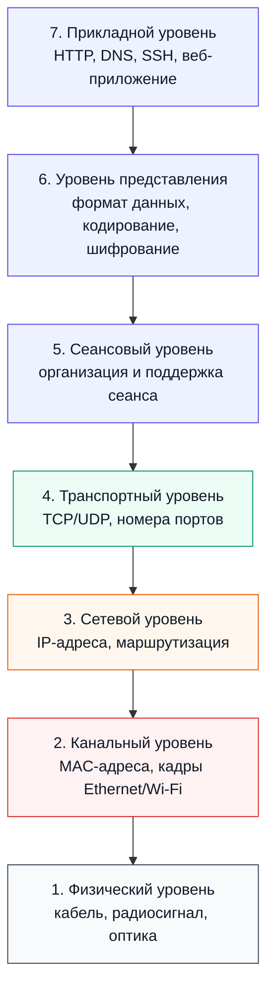

**Краткий ответ**

Модель OSI делит сетевое взаимодействие на семь уровней. Это помогает понимать, где именно появляется адрес, порт, протокол или ошибка.

| № | Уровень OSI | Что важно помнить |
|---|---|---|
| 7 | Прикладной | `HTTP`, `DNS`, пользовательские приложения |
| 6 | Представления | формат данных, кодирование, шифрование |
| 5 | Сеансовый | управление сеансом связи |
| 4 | Транспортный | `TCP`, `UDP`, номера портов |
| 3 | Сетевой | `IP`-адреса и маршрутизация |
| 2 | Канальный | `MAC`-адреса в локальной сети |
| 1 | Физический | кабель, сигнал, радиоканал |

**Объяснение**

- `MAC`-адрес нужен для доставки кадра внутри локального сегмента.
- `IP`-адрес нужен для доставки пакета между сетями.
- Номер порта нужен, чтобы операционная система передала данные нужной программе.
- Разделение на уровни помогает искать проблему: кабель, адресация, маршрут, порт или приложение.

**Пример**

- Браузер использует `HTTP/HTTPS` на прикладном уровне.
- `TCP` работает с портом на транспортном уровне.
- `IP` выбирает путь между сетями.
- `MAC` используется внутри локальной сети.

**Как ответить на экзамене**

> OSI нужна как схема анализа сети: каждый уровень отвечает за свою часть передачи данных, а адреса и порты появляются на разных уровнях.

</details>

### 3. OSI и TCP/IP

**Вопрос**

Сравните модели OSI и `TCP/IP`, опишите соответствие их уровней в виде простой схемы, объясните, почему модель `TCP/IP` чаще используется при описании реальной работы Интернета.

**Еще один вариант вопроса**

Сравните OSI и `TCP/IP` на примере открытия веб-страницы, какие уровни участвуют в передаче, почему практическое описание чаще строится вокруг `TCP/IP`.

> **Подумайте:** Назовите 7 уровней OSI и 5 уровней TCP/IP: Application, Transport, Network/Internet, Data Link, Physical.

<details>
<summary><strong>Показать ответ и объяснение</strong></summary>

**Схема**

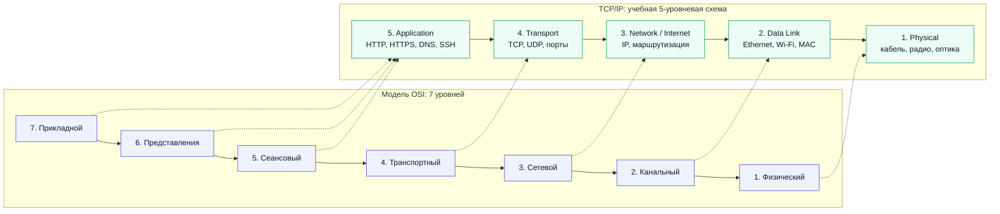

**Краткий ответ**

`OSI` — это семиуровневая модель для анализа сетевого взаимодействия. `TCP/IP` чаще используют для объяснения реальной работы Интернета. В учебной 5-уровневой схеме `TCP/IP` выделяют такие уровни:

| Уровень TCP/IP | Что делает | Примеры |
|---|---|---|
| 5. Прикладной | Правила работы сетевых приложений | `HTTP`, `HTTPS`, `DNS`, `FTP`, `SSH` |
| 4. Транспортный | Передача данных между программами | `TCP`, `UDP`, порты |
| 3. Сетевой / Internet | Доставка пакетов между сетями | `IP`, маршрутизация |
| 2. Канальный | Передача кадров внутри локальной сети | `Ethernet`, `Wi-Fi`, `MAC` |
| 1. Физический | Передача сигнала по среде | кабель, радиосигнал, оптика |

**Объяснение**

| OSI | 5-уровневая TCP/IP-схема | Смысл соответствия |
|---|---|---|
| 7. Прикладной | Прикладной | сетевые сервисы и протоколы приложений |
| 6. Представления | Прикладной | формат данных, кодирование, часто шифрование на уровне приложения/сеанса |
| 5. Сеансовый | Прикладной | логика сеанса обмена между приложениями |
| 4. Транспортный | Транспортный | `TCP`, `UDP`, номера портов |
| 3. Сетевой | Сетевой / Internet | `IP` и маршрутизация между сетями |
| 2. Канальный | Канальный | кадры, `MAC`, локальная доставка |
| 1. Физический | Физический | сигнал и физическая среда передачи |

**Пример открытия веб-страницы**

| Что происходит | Уровень TCP/IP |
|---|---|
| Браузер использует `DNS` и отправляет `HTTP/HTTPS`-запрос | прикладной |
| Для надежной передачи используется `TCP` и порт `443` | транспортный |
| Пакеты идут по `IP`-адресам через маршрутизаторы | сетевой / Internet |
| В локальной сети кадры передаются по `MAC`-адресам | канальный |
| Биты передаются как электрический, оптический или радиосигнал | физический |

**Как ответить на экзамене**

> OSI состоит из 7 уровней и удобна для анализа. В 5-уровневой TCP/IP-схеме используются уровни: прикладной, транспортный, сетевой/Internet, канальный и физический. Реальная работа Интернета чаще объясняется через TCP/IP, потому что именно эта модель ближе к используемым протоколам.

**Важно**

- Нельзя сокращать OSI до цепочки «приложение → транспорт → сеть → канал». Это неполная схема.
- Если преподаватель просит 5 уровней TCP/IP, называйте именно: `Application`, `Transport`, `Network/Internet`, `Data Link`, `Physical`.

</details>

### 4. Концентратор, коммутатор и маршрутизатор

**Вопрос**

Сравните концентратор, коммутатор и маршрутизатор, объясните, на каких уровнях модели OSI они работают, укажите, какое устройство применяется для соединения разных IP-сетей.

**Еще один вариант вопроса**

Объясните выбор сетевого устройства для конкретной задачи, когда достаточно коммутатора, когда нужен маршрутизатор, почему концентратор считается устаревшим решением.

> **Подумайте:** сравните устройства по тому, с чем они работают: сигнал, MAC-адрес или IP-адрес.

<details>
<summary><strong>Показать ответ и объяснение</strong></summary>

**Схема**

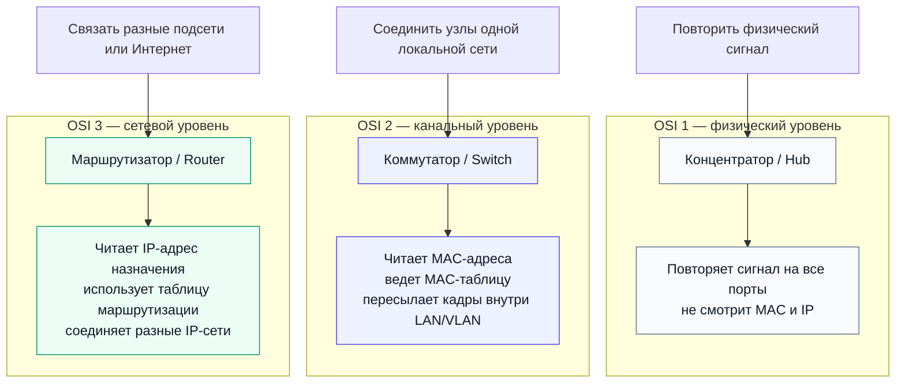

**Краткий ответ**

| Устройство | Уровень OSI | С чем работает | Что делает | Когда использовать |
|---|---:|---|---|---|
| Концентратор | 1 — физический | Сигнал, биты | Повторяет сигнал на все порты | Почти не используется; устаревшее решение |
| Коммутатор | 2 — канальный | MAC-адреса, Ethernet-кадры | Передает кадры внутри локальной сети | Когда устройства находятся в одной локальной сети или VLAN |
| Маршрутизатор | 3 — сетевой | IP-адреса, IP-пакеты | Соединяет разные IP-сети и выбирает маршрут | Когда нужно связать разные подсети или выйти в Интернет |

**Объяснение**

Концентратор — самое простое устройство. Он не понимает, кому именно предназначены данные, поэтому повторяет сигнал на все порты. Из-за этого сеть работает менее эффективно: появляется лишний трафик, а все устройства фактически делят одну среду передачи.

Коммутатор работает умнее. Он запоминает, за каким портом находится какой MAC-адрес, и передает кадр только туда, куда нужно. Поэтому для обычной локальной сети, где устройства находятся в одной VLAN и одной IP-подсети, обычно достаточно коммутатора.

Маршрутизатор нужен тогда, когда адрес назначения находится в другой IP-сети. Он анализирует IP-адрес назначения, смотрит таблицу маршрутизации и решает, через какой интерфейс отправить пакет дальше. Поэтому именно маршрутизатор соединяет разные подсети, например домашнюю сеть и Интернет.

**Пример**

| Ситуация | Нужное устройство | Почему |
|---|---|---|
| `192.168.1.10/24` должен обменяться данными с `192.168.1.20/24` | Коммутатор | Оба адреса находятся в сети `192.168.1.0/24` |
| `192.168.1.10/24` должен обратиться к `10.0.0.5/24` | Маршрутизатор | Это разные IP-сети: `192.168.1.0/24` и `10.0.0.0/24` |
| Нужно объяснить, почему hub устарел | Сравнить с коммутатором | Hub повторяет сигнал всем портам, а switch передает кадр только нужному получателю |

**Как ответить на экзамене**

> Концентратор работает на физическом уровне и просто повторяет сигнал. Коммутатор работает на канальном уровне и передает кадры по MAC-адресам внутри локальной сети. Маршрутизатор работает на сетевом уровне, использует IP-адреса и соединяет разные IP-сети. Поэтому для связи разных подсетей нужен маршрутизатор.

**Важно**

Не путайте коммутатор и маршрутизатор. Коммутатор обычно не заменяет маршрутизатор: он хорошо соединяет устройства внутри одной локальной сети, но для связи разных IP-сетей нужен маршрутизатор или устройство с функцией маршрутизации.

</details>

### 5. Подсети и маска

**Вопрос**

Объясните, когда две сети считаются разными, как это определяется по IP-адресу и маске подсети, почему для обмена данными между разными сетями требуется маршрутизатор.

**Еще один вариант вопроса**

Покажите принцип определения разных подсетей на простом примере, как маска влияет на адрес сети, почему устройства из разных подсетей не обмениваются напрямую без маршрутизации.

> **Подумайте:** Найдите адрес сети через IP AND маска и сравните результат у двух адресов.

<details>
<summary><strong>Показать ответ и объяснение</strong></summary>


**Краткий ответ**

- Две сети считаются разными, если после применения маски подсети к IP-адресам получаются разные адреса сети.
- Устройства из разных подсетей обычно общаются через шлюз, то есть маршрутизатор.

**Объяснение**

- Маска показывает, какая часть адреса является сетевой.
- Если адрес сети совпадает, узлы находятся в одной подсети.
- Если адрес сети отличается, пакет отправляют через маршрутизатор.

**Пример**

- `192.168.1.10/24` принадлежит сети `192.168.1.0`.
- `192.168.2.10/24` принадлежит сети `192.168.2.0`.
- Это разные сети.

**Как ответить на экзамене**

> Сравнивают не только IP-адреса, а адреса сети после применения маски.


</details>

### 6. ICMP и ping

**Вопрос**

Раскройте назначение протокола `ICMP`, объясните, почему он используется при проверке доступности узла, укажите, почему успешная проверка доступности не всегда означает исправность прикладного сервиса.

**Еще один вариант вопроса**

Объясните, как диагностическая проверка доступности помогает найти сетевую проблему, почему нужно проверять localhost, собственный адрес, шлюз, `DNS`-сервер и внешний сайт.

> **Подумайте:** Разделите проверку достижимости хоста и проверку работы конкретного сервиса.

<details>
<summary><strong>Показать ответ и объяснение</strong></summary>

**Схема**

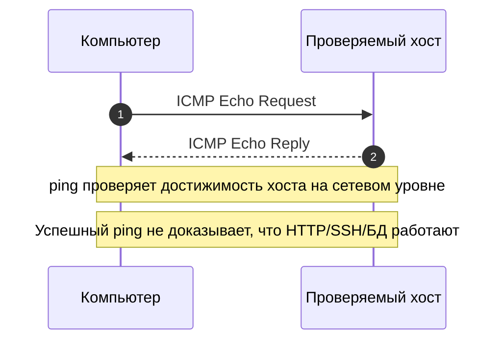

**Краткий ответ**

- `ICMP` используется для служебных сетевых сообщений.
- Команда `ping` обычно проверяет, отвечает ли узел на `ICMP` Echo Request.

**Объяснение**

- Если `ping` успешен, узел доступен на уровне IP/`ICMP`.
- Но веб-сервер, `SSH` или база данных могут быть остановлены, заблокированы firewall или слушать другой порт.

**Пример**

Сервер отвечает на `ping`, но сайт не открывается, потому что `Nginx` не запущен.

**Как ответить на экзамене**

> Ping проверяет доступность узла, а не исправность конкретного приложения.


</details>

### 7. TCP и UDP

**Вопрос**

Сравните `TCP` и `UDP`, объясните различия по надежности, скорости и способу передачи данных, укажите, какой протокол устанавливает соединение перед обменом данными.

**Еще один вариант вопроса**

Сравните `TCP` и `UDP` на примере передачи файла, видеозвонка и простого запроса к серверу, какой протокол лучше подходит в каждом случае, почему.

> **Подумайте:** Сравните установление соединения, надежность, порядок доставки и задержку.

<details>
<summary><strong>Показать ответ и объяснение</strong></summary>

**Схема**

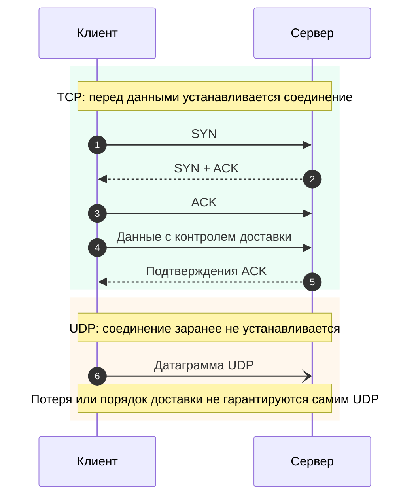

**Краткий ответ**

| Признак | `TCP` | `UDP` |
|---|---|---|
| Соединение | устанавливает соединение | не устанавливает соединение |
| Надежность | контролирует доставку и порядок | не гарантирует доставку |
| Скорость и задержка | обычно больше накладных расходов | обычно меньше накладных расходов |
| Подходит для | файлы, веб-запросы, надежный обмен | видео, голос, быстрые короткие сообщения |

**Объяснение**

- `TCP` сначала устанавливает соединение и следит, чтобы данные дошли корректно.
- `UDP` отправляет датаграммы без подтверждения доставки.
- Если важна полнота и порядок данных, обычно выбирают `TCP`.
- Если важна минимальная задержка и допустимы потери, часто выбирают `UDP`.

**Пример**

- Передача файла: лучше `TCP`.
- Видеозвонок: часто лучше `UDP`, потому что небольшая потеря хуже не делает, а задержка заметна.

**Как ответить на экзамене**

> `TCP` надежнее, потому что устанавливает соединение и контролирует доставку. `UDP` проще и быстрее, но не гарантирует доставку пакетов.

</details>

### 8. HTTP и HTTPS

**Вопрос**

Объясните различие между `HTTP` и `HTTPS`, укажите их стандартные порты, поясните, какую роль играет шифрование при передаче данных через `HTTPS`.

**Еще один вариант вопроса**

Объясните, почему `HTTPS` считается безопаснее `HTTP`, какие данные защищает шифрование, почему номер порта помогает серверу определить нужный сетевой сервис.

> **Подумайте:** Вспомните порты 80 и 443 и объясните, что TLS добавляет к HTTP.

<details>
<summary><strong>Показать ответ и объяснение</strong></summary>

**Схема**

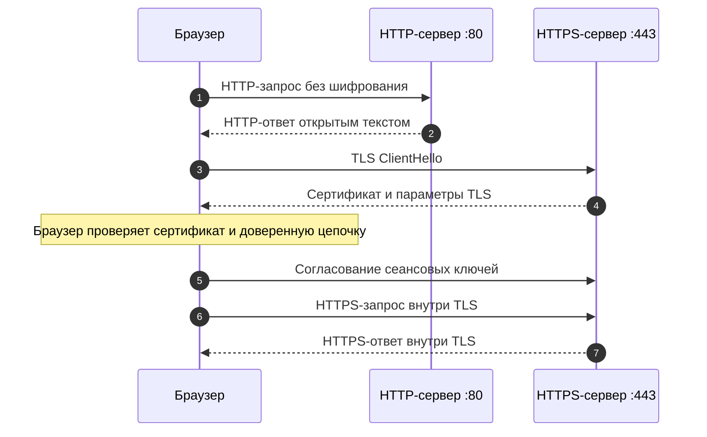

**Краткий ответ**

| Протокол | Порт по умолчанию | Что делает |
|---|---:|---|
| `HTTP` | `80` | передает веб-данные без встроенного шифрования |
| `HTTPS` | `443` | передает веб-данные через защищенное соединение `TLS` |

**Объяснение**

- `HTTPS` защищает содержимое обмена от простого чтения и изменения по пути.
- Порт помогает серверу понять, какому сетевому сервису передать входящее соединение.
- Сам номер порта не шифрует данные; безопасность дает именно `TLS`.

**Пример**

- `http://example.com` обычно обращается к порту `80`.
- `https://example.com` обычно обращается к порту `443`.

**Как ответить на экзамене**

> `HTTPS` — это HTTP поверх защищенного TLS-соединения. Поэтому он безопаснее обычного `HTTP` при передаче данных через сеть.

</details>

### 9. NAT

**Вопрос**

Объясните назначение `NAT`, какую проблему IPv4 он помогает решить, почему `NAT` часто используется в домашних и корпоративных сетях.

**Еще один вариант вопроса**

Поясните, как `NAT` позволяет нескольким устройствам использовать один внешний IPv4-адрес, какие преимущества это дает, какие ограничения появляются для входящих соединений.

> **Подумайте:** Покажите, как несколько частных адресов используют один внешний адрес роутера.

<details>
<summary><strong>Показать ответ и объяснение</strong></summary>

**Схема**

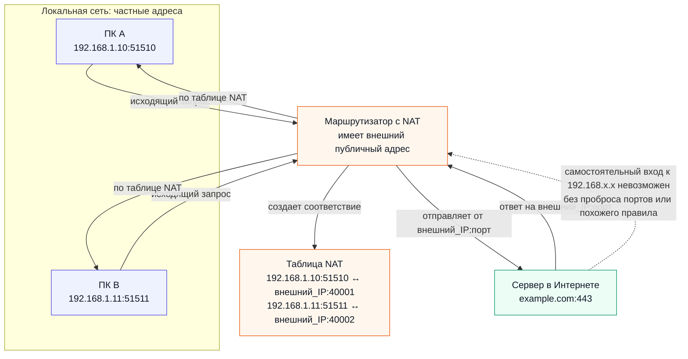

**Краткий ответ**

- `NAT` изменяет адреса и часто порты в пакетах при прохождении через роутер.
- Несколько внутренних устройств с частными адресами выходят в Интернет через один внешний адрес роутера.

**Объяснение**

- Для исходящих соединений роутер ведет таблицу соответствий: внутренний адрес и порт ↔ внешний адрес и порт.
- Когда приходит ответ, роутер понимает, какому внутреннему устройству его вернуть.

**Пример**

Ноутбук `192.168.1.10` и телефон `192.168.1.11` выходят в Интернет через один внешний адрес роутера.

**Как ответить на экзамене**

> `NAT` экономит IPv4-адреса, но усложняет входящие соединения к внутренним устройствам.


</details>

### 10. IPv4, IPv6 и MAC

**Вопрос**

Сравните IPv4, IPv6 и MAC-адрес, объясните назначение каждого вида адреса, укажите, чем отличаются логический и физический адрес.

**Еще один вариант вопроса**

Сравните логическую и физическую адресацию в сети, когда используется IP-адрес, когда используется MAC-адрес, почему оба вида адресов нужны одновременно.

> **Подумайте:** Разделите логическую адресацию IP и физическую адресацию MAC.

<details>
<summary><strong>Показать ответ и объяснение</strong></summary>

**Краткий ответ**

- IPv4 и IPv6 — логические сетевые адреса для маршрутизации между сетями.
- MAC-адрес — канальный адрес сетевого интерфейса для локальной передачи кадров.

**Объяснение**

- IP-адрес может меняться при подключении к другой сети.
- MAC-адрес обычно связан с сетевой картой.
- Для передачи через Интернет нужен IP, для передачи внутри локального сегмента нужен MAC.

**Пример**

IP отвечает на вопрос «куда доставить между сетями», MAC — «какому устройству передать кадр в этой локальной сети».

**Как ответить на экзамене**

> Логический адрес — IP. Канальный адрес — MAC.


</details>

### 11. Адрес сети

**Вопрос**

Объясните назначение маски подсети, покажите, как она помогает определить адрес сети, поясните смысл логической операции между IP-адресом и маской.

**Еще один вариант вопроса**

Объясните, как с помощью маски подсети получить адрес сети, почему эта операция важна для маршрутизации, как ошибка в маске влияет на сетевое взаимодействие.

> **Подумайте:** Покажите, что маска оставляет сетевую часть адреса и помогает выбрать маршрут.

<details>
<summary><strong>Показать ответ и объяснение</strong></summary>

**Схема**

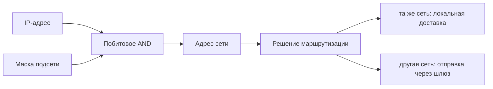

**Краткий ответ**

- Адрес сети получают логической операцией AND между IP-адресом и маской подсети.
- Маска показывает, какие биты относятся к сети, а какие — к узлу.

**Объяснение**

- При маске `/24` первые 24 бита являются сетевой частью.
- Для адреса `192.168.1.29/24` адрес сети будет `192.168.1.0`.

**Пример**

`192.168.1.29 AND 255.255.255.0 = 192.168.1.0`.

**Как ответить на экзамене**

> Маска нужна маршрутизации: она помогает понять, локальный адрес или пакет надо отправить через шлюз.


</details>

### 12. Пример одной подсети

**Вопрос**

Проанализируйте адреса `192.168.1.29/24` и `192.168.1.9/24`, объясните, принадлежат ли они одной сети, покажите общий принцип проверки принадлежности адресов к одной подсети.

**Еще один вариант вопроса**

Проверьте принадлежность адресов `192.168.1.29/24` и `192.168.1.9/24` к одной сети, объясните ход рассуждения, укажите, какой адрес сети получается при такой маске.

> **Подумайте:** Примените /24: первые три октета образуют адрес сети.

<details>
<summary><strong>Показать ответ и объяснение</strong></summary>

**Краткий ответ**

- Да.
- Оба адреса принадлежат сети `192.168.1.0/24`.

**Объяснение**

- При `/24` первые три октета являются сетевой частью.
- У обоих адресов они одинаковые: `192.168.1`.
- Различается только адрес узла: `29` и `9`.

**Пример**

Сеть: `192.168.1.0/24`; узлы: `192.168.1.29` и `192.168.1.9`.

**Как ответить на экзамене**

> Сначала находите адрес сети для каждого IP, затем сравнивайте.


</details>

### 13. Некорректный IPv4

**Вопрос**

Оцените корректность IP-адреса `10.52.9.379`, объясните, почему адрес IPv4 имеет ограничения по значениям октетов, укажите, какие ошибки делают адрес недопустимым.

**Еще один вариант вопроса**

Разберите пример некорректного IPv4-адреса `10.52.9.379`, какие правила нарушены, почему каждое число в адресе IPv4 имеет ограниченный диапазон.

> **Подумайте:** Проверьте четыре октета: каждый должен быть числом от 0 до 255.

<details>
<summary><strong>Показать ответ и объяснение</strong></summary>

**Краткий ответ**

- IPv4-адрес состоит из четырех октетов, и каждый октет должен быть числом от 0 до 255.
- В адресе `10.52.9.379` последний октет равен 379, поэтому адрес недопустим.

**Объяснение**

- Октет содержит 8 бит.
- Максимальное значение 8 бит — 255.
- Все, что больше 255, не может быть обычным октетом IPv4-адреса.

**Пример**

Корректный похожий адрес: `10.52.9.37`.

**Как ответить на экзамене**

> IPv4: четыре числа, каждое в диапазоне 0–255.


</details>

### 14. Классовая адресация

**Вопрос**

Объясните классовую адресацию IPv4, сравните классы A, B и C, укажите, как в них исторически распределялись биты сети и узла.

**Еще один вариант вопроса**

Сравните классы IPv4 A, B и C как исторический способ адресации, какие маски им соответствуют по умолчанию, почему в современных сетях чаще применяют бесклассовую адресацию.

> **Подумайте:** Вспомните исторические классы A, B, C и их маски по умолчанию.

<details>
<summary><strong>Показать ответ и объяснение</strong></summary>

**Краткий ответ**

- Исторически IPv4-адреса делили на классы A, B и C.
- Класс A имел маску `/8`, класс B — `/16`, класс C — `/24`.
- Сейчас чаще используют CIDR, где префикс задается явно, например `/24` или `/27`.

**Объяснение**

- Классовая схема была слишком грубой и неэкономно расходовала адреса.
- CIDR позволяет гибко выбирать размер сети и лучше использовать адресное пространство.

**Пример**

`192.168.1.0/24` явно указывает размер сети через `/24`.

**Как ответить на экзамене**

> Классы важны для истории, но в современной настройке смотрят на CIDR-префикс.


</details>

### 15. Прямое подключение и NAT

**Вопрос**

Объясните различие между прямым подключением к Интернету и подключением через `NAT`, сравните их с точки зрения доступности устройства извне, безопасности и необходимости дополнительной защиты.

**Еще один вариант вопроса**

Оцените безопасность прямого подключения и подключения через `NAT`, какое соединение легче доступно из Интернета, почему `NAT` не заменяет полноценную защиту сервера.

> **Подумайте:** Сравните прямую видимость устройства из Интернета и защитный эффект NAT.

<details>
<summary><strong>Показать ответ и объяснение</strong></summary>

**Краткий ответ**

- Устройство с публичным адресом потенциально доступно из Интернета напрямую.
- Устройство за `NAT` обычно недоступно для входящих соединений без проброса портов.
- Поэтому `NAT` часто уменьшает прямую доступность, но не является полноценной защитой.

**Объяснение**

- Безопасность зависит также от firewall, обновлений, паролей, `SSH`-ключей и настроек приложений.
- Если настроить port forwarding, внутренний сервис снова станет доступным извне.

**Пример**

- Домашний ноутбук за `NAT` обычно не виден из Интернета.
- Сервер с публичным IP и открытым `SSH` доступен напрямую.

**Как ответить на экзамене**

> `NAT` снижает риск случайного внешнего доступа, но firewall и безопасная настройка всё равно обязательны.


</details>

### 16. DNS и DHCP

**Вопрос**

Объясните, зачем в сети используются `DNS` и `DHCP`, сравните их функции, покажите, почему оба сервиса важны для удобной работы пользователей.

**Еще один вариант вопроса**

Покажите связь `DNS` и `DHCP` в обычной локальной сети, какие параметры получает клиент, почему без этих служб пользователю пришлось бы вручную вводить больше настроек.

> **Подумайте:** DNS работает с именами, DHCP автоматически выдает сетевые параметры.

<details>
<summary><strong>Показать ответ и объяснение</strong></summary>

**Схема**

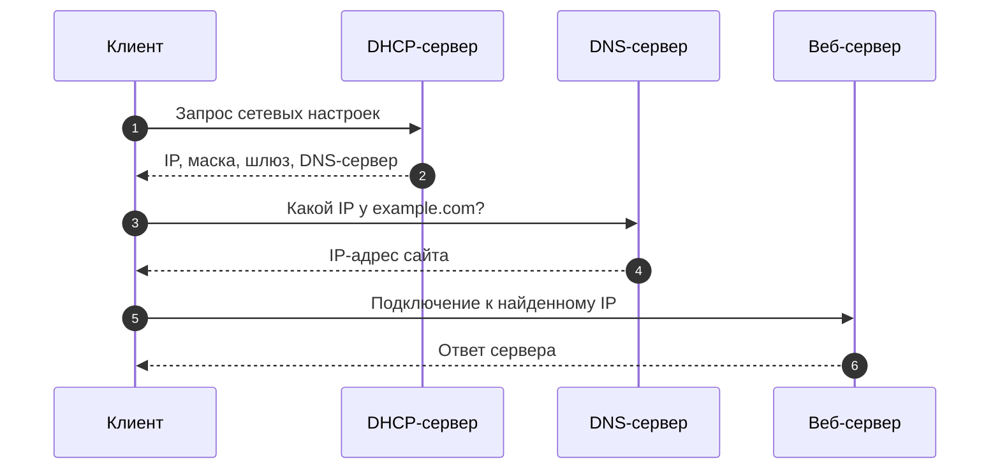

**Краткий ответ**

| Сервис | Назначение | Пример результата |
|---|---|---|
| `DNS` | преобразует имя сайта в IP-адрес | `example.com` → IP-адрес сервера |
| `DHCP` | автоматически выдает сетевые параметры клиенту | IP-адрес, маска, шлюз, DNS-сервер |

**Объяснение**

- Без `DNS` пользователю пришлось бы помнить IP-адреса сайтов.
- Без `DHCP` IP-адрес, маску, шлюз и DNS-сервер часто пришлось бы вводить вручную.
- Эти службы решают разные задачи, но вместе делают сеть удобной для пользователя.

**Как ответить на экзамене**

> `DNS` отвечает за имена, а `DHCP` — за автоматическую настройку сетевых параметров компьютера.

</details>

### 17. FTP, HTTP и DNS

**Вопрос**

Раскройте назначение протоколов `FTP`, `HTTP` и `DNS`, объясните, какие задачи они решают, покажите, чем они отличаются по роли в сетевом взаимодействии.

**Еще один вариант вопроса**

Сравните `FTP`, `HTTP` и `DNS` с точки зрения назначения, какие данные передаются каждым протоколом, почему их нельзя считать взаимозаменяемыми.

> **Подумайте:** Сравните назначение протоколов: файлы, веб-страницы и преобразование имен.

<details>
<summary><strong>Показать ответ и объяснение</strong></summary>

**Краткий ответ**

`FTP` предназначен для передачи файлов, `HTTP` — для передачи веб-ресурсов и данных веб-приложений, `DNS` — для преобразования доменных имен в IP-адреса.

**Объяснение**

- Каждый протокол имеет свою задачу и формат сообщений.
- Браузер не может использовать `DNS` вместо `HTTP` для загрузки страницы, а `FTP` не заменяет `DNS` для поиска адреса сайта.

**Пример**

Открытие сайта: `DNS` находит IP, затем `HTTP/HTTPS` получает страницу.

**Как ответить на экзамене**

> `DNS` ищет адрес, `HTTP` получает веб-ресурс, `FTP` передает файлы.


</details>

### 18. Адрес, порт и протокол

**Вопрос**

Объясните связь между адресом, портом и протоколом транспортного уровня, почему для сетевого приложения недостаточно знать только IP-адрес, покажите роль порта в выборе нужной программы на сервере.

**Еще один вариант вопроса**

Объясните, как IP-адрес, порт и протокол совместно определяют сетевое соединение, почему разные приложения могут работать на одном сервере одновременно.

> **Подумайте:** IP выбирает узел, порт выбирает программу, протокол задает правила обмена.

<details>
<summary><strong>Показать ответ и объяснение</strong></summary>


**Краткий ответ**

- IP-адрес указывает узел, но на одном узле может работать много приложений.
- Порт выбирает конкретный сервис, а протокол показывает способ передачи данных: `TCP` или `UDP`.

**Объяснение**

- Например, один сервер может одновременно принимать `HTTPS` на `TCP` 443, `SSH` на `TCP` 22 и `DNS` на `UDP` 53.
- Без порта непонятно, к какой программе обращаться.

**Пример**

`адрес_сервера:443/TCP` и `адрес_сервера:22/TCP` — разные сервисы на одном сервере.

**Как ответить на экзамене**

> IP — какой узел, порт — какая программа, протокол — как передавать.


</details>

### 19. Диагностика сети

**Вопрос**

Объясните, как выполняется диагностика сетевого подключения, какие этапы проверки помогают найти проблему, почему важно отдельно проверять локальный интерфейс, шлюз, `DNS` и внешний сервер.

**Еще один вариант вопроса**

Составьте логическую последовательность диагностики сети, от проверки локального узла до проверки внешнего ресурса, как по результатам определить место возможной неисправности.

> **Подумайте:** Проверяйте цепочку по шагам: локальный стек, интерфейс, шлюз, Интернет, DNS, сервис.

<details>
<summary><strong>Показать ответ и объяснение</strong></summary>

**Схема**

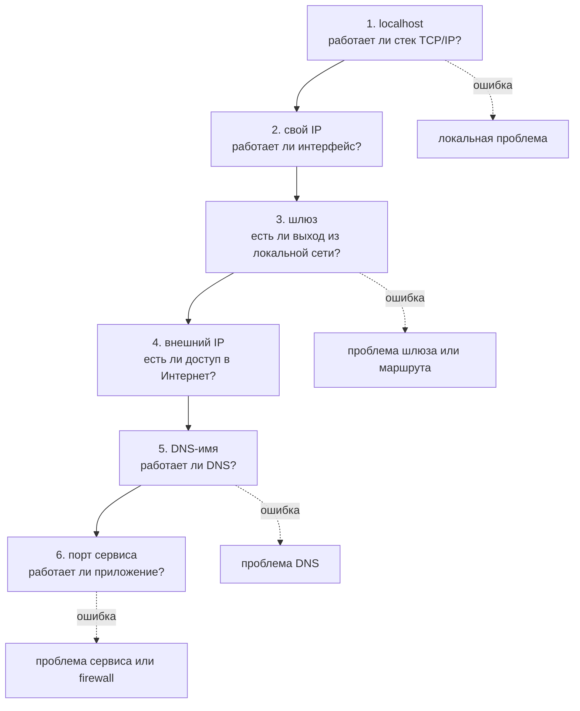

**Краткий ответ**

Диагностику лучше вести по шагам: локальный интерфейс, собственный IP, шлюз, внешний IP, `DNS`, затем конкретный сервис.

**Объяснение**

- Такой порядок помогает понять, где проблема: в локальной машине, локальной сети, маршрутизации, `DNS` или приложении.

**Пример**

Пример: `ip addr` → `ping 127.0.0.1` → `ping шлюз` → `ping 8.8.8.8` → `nslookup example.com` → проверка порта сервиса.

**Как ответить на экзамене**

> Не начинайте сразу с сайта. Сначала проверьте основу сети.


</details>

### 20. Таблица маршрутизации

**Вопрос**

Объясните назначение таблицы маршрутизации, как она помогает выбрать путь для пакета, почему неправильный маршрут может нарушить доступ к другим сетям.

**Еще один вариант вопроса**

Объясните роль таблицы маршрутизации для выхода в Интернет, что такое маршрут по умолчанию, почему его отсутствие делает внешние сети недоступными.

> **Подумайте:** Объясните, как система выбирает следующий узел и зачем нужен маршрут по умолчанию.

<details>
<summary><strong>Показать ответ и объяснение</strong></summary>

**Схема**

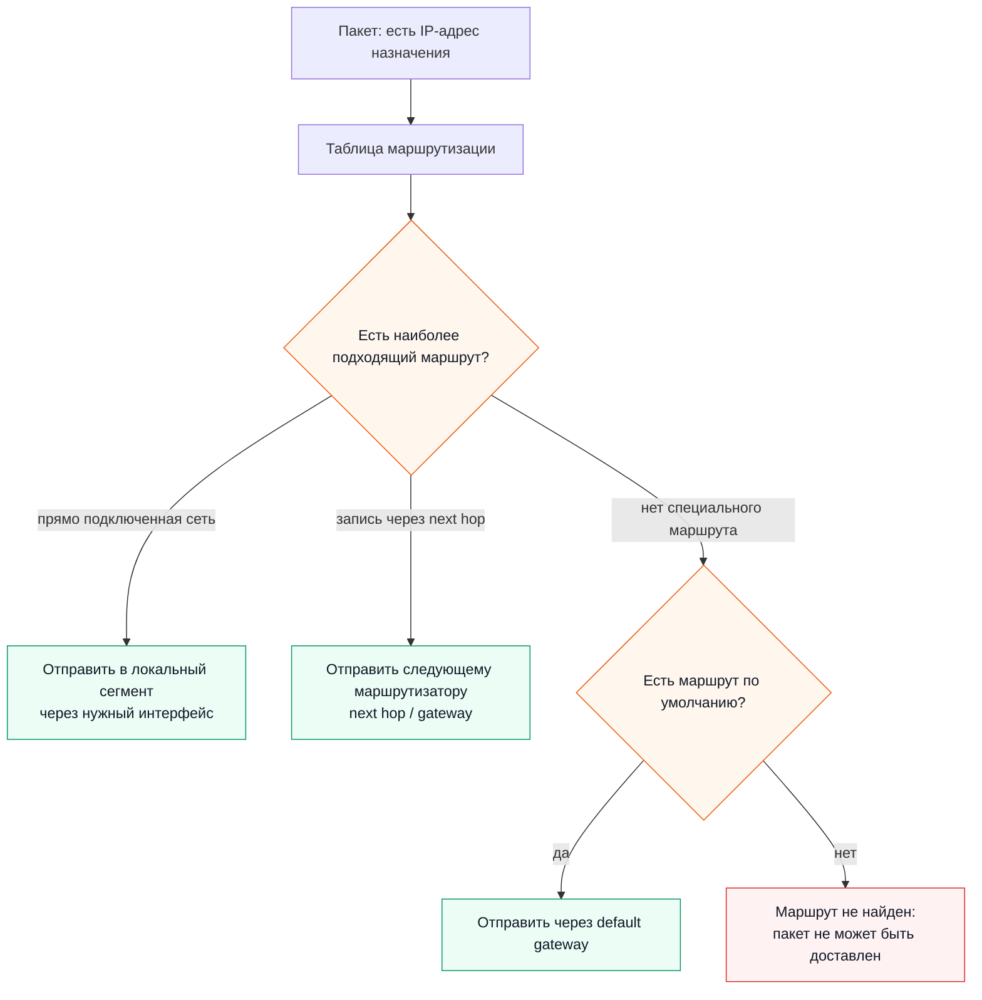

**Краткий ответ**

- Таблица маршрутизации показывает, куда отправлять пакеты для разных сетей.
- Маршрут по умолчанию используется, когда нет более точного маршрута, и обычно ведет к шлюзу для выхода в Интернет.

**Объяснение**

- Если маршрут по умолчанию отсутствует или неверный, компьютер может видеть локальную сеть, но не сможет обращаться к внешним адресам.

**Пример**

Посмотреть маршруты можно командами `ip route` или `netstat -r`.

**Как ответить на экзамене**

> Default `route` — путь для всего, что не попало под более точное правило.


</details>

### 21. Имя хоста

**Вопрос**

Объясните назначение имени хоста в Linux-системе, как оно связано с идентификацией компьютера в сети, почему корректное имя удобно при администрировании.

**Еще один вариант вопроса**

Поясните, как имя хоста помогает в администрировании Linux-системы, где оно используется, почему понятные имена упрощают работу с несколькими серверами.

> **Подумайте:** Свяжите hostname с удобной идентификацией компьютера в сети и администрировании.

<details>
<summary><strong>Показать ответ и объяснение</strong></summary>

**Краткий ответ**

- Имя хоста — понятное имя компьютера или сервера.
- Оно используется в терминале, логах, сетевых настройках и администрировании.

**Объяснение**

- Когда серверов много, имена помогают не перепутать роли машин.
- Например, `web01` сразу понятнее, чем случайный IP-адрес.

**Пример**

Команда `hostname` показывает или изменяет имя хоста.

**Как ответить на экзамене**

> Хорошее имя хоста уменьшает ошибки администратора.


</details>

## Тема 11. Настройка окружения Python

### 22. Beautiful Soup

**Вопрос**

Объясните назначение библиотеки Beautiful Soup, в каких задачах веб-парсинга она используется, какие ограничения и этические правила нужно учитывать при сборе данных с сайтов.

**Еще один вариант вопроса**

Опишите корректное использование Beautiful Soup для извлечения данных из HTML, какие данные можно получить, какие ограничения сайта и этические правила нужно учитывать.

> **Подумайте:** Назовите HTML-парсинг, извлечение данных и ограничения корректного сбора информации.

<details>
<summary><strong>Показать ответ и объяснение</strong></summary>

**Краткий ответ**

- Beautiful Soup — библиотека Python для разбора HTML/XML и извлечения данных из страниц.
- Она помогает находить элементы по тегам, атрибутам, классам и структуре документа.

**Объяснение**

- Парсинг нужно выполнять аккуратно: учитывать правила сайта, условия использования, авторские права и нагрузку на сервер.
- Beautiful Soup не выполняет JavaScript как браузер, поэтому динамические данные могут отсутствовать в исходном HTML.

**Пример**

Можно извлечь заголовки из HTML-страницы, но нельзя без разрешения агрессивно скачивать весь сайт.

**Как ответить на экзамене**

> Beautiful Soup разбирает HTML, но не отменяет технические и этические ограничения.


</details>

### 23. Виртуальное окружение

**Вопрос**

Объясните роль виртуального окружения Python, почему зависимости проекта лучше изолировать, какие проблемы возникают при установке всех библиотек в системный Python.

**Еще один вариант вопроса**

Поясните, почему виртуальное окружение важно в учебных и реальных Python-проектах, какие конфликты зависимостей оно предотвращает, как повышает переносимость проекта.

> **Подумайте:** Свяжите ответ с изоляцией зависимостей и независимостью проектов.

<details>
<summary><strong>Показать ответ и объяснение</strong></summary>

**Краткий ответ**

- Виртуальное окружение изолирует зависимости конкретного проекта.
- У проекта появляется свой набор пакетов, который не смешивается с системным Python и другими проектами.

**Объяснение**

- Это предотвращает конфликты версий.
- Один проект может требовать одну версию библиотеки, другой — другую.
- Если ставить все глобально, один проект может случайно сломать другой.

**Пример**

Обычно создают окружение командой `python -m venv .venv`.

**Как ответить на экзамене**

> Отдельный проект — отдельное окружение.


</details>

### 24. requirements.txt

**Вопрос**

Раскройте назначение файла `requirements.txt`, объясните, почему он важен для повторяемой установки проекта, покажите, как он помогает при переносе проекта на другой компьютер или сервер.

**Еще один вариант вопроса**

Раскройте роль `requirements.txt` при переносе Python-проекта на другой компьютер или сервер, почему список зависимостей должен быть точным, какие проблемы возникают без него.

> **Подумайте:** Покажите, как список зависимостей помогает повторить окружение на другом компьютере.

<details>
<summary><strong>Показать ответ и объяснение</strong></summary>

**Краткий ответ**

- `requirements.txt` содержит список зависимостей проекта, часто с версиями.
- Он нужен для повторяемой установки библиотек на другом компьютере или сервере.

**Объяснение**

- При переносе проекта другой пользователь может выполнить `pip install -r requirements.txt` и получить нужную среду.
- Без такого файла трудно понять, какие пакеты требуются приложению.

**Пример**

`Flask==3.0.0`, `requests==2.31.0`, `beautifulsoup4==4.12.3`.

**Как ответить на экзамене**

> Код без списка зависимостей сложно надежно запустить в другой среде.


</details>

## Тема 12. Git и GitHub

### 25. Назначение Git

**Вопрос**

Объясните назначение Git как системы контроля версий, какие проблемы разработки он решает, почему история изменений важна для индивидуальной и командной работы.

**Еще один вариант вопроса**

Объясните, почему Git полезен даже для одного разработчика, как история изменений помогает исправлять ошибки, почему коммиты должны быть осмысленными.

> **Подумайте:** Разделите рабочую директорию, индекс, коммит и удаленный репозиторий.

<details>
<summary><strong>Показать ответ и объяснение</strong></summary>

**Схема**

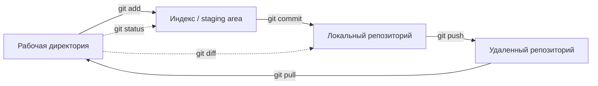

**Краткий ответ**

- Git — распределенная система контроля версий.
- Он хранит историю изменений, позволяет сравнивать версии, возвращаться назад и безопасно экспериментировать.

**Объяснение**

- Даже один разработчик может ошибиться, удалить код или захотеть посмотреть старую реализацию.
- Осмысленные коммиты помогают понять, когда и зачем было сделано изменение.

**Пример**

`git add file.py` → `git commit -m "Add parser"`.

**Как ответить на экзамене**

> Git — это история проекта и защита от хаотичных изменений.


</details>

### 26. Ветки

**Вопрос**

Объясните назначение веток в Git, почему разработчики создают отдельные ветки для новых функций, приведите пример работы над изменением без повреждения основной версии проекта.

**Еще один вариант вопроса**

Покажите типичный сценарий использования ветки в Git, как разработчик изолирует новую функцию, как затем изменение попадает в основную ветку проекта.

> **Подумайте:** Объясните, как ветка изолирует новую работу от основной версии проекта.

<details>
<summary><strong>Показать ответ и объяснение</strong></summary>

**Схема**

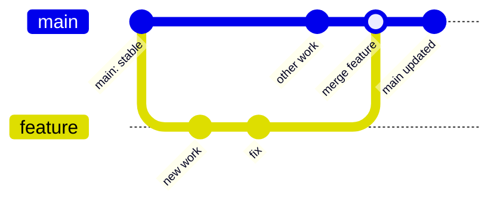

**Краткий ответ**

- Ветка — отдельная линия разработки.
- Она позволяет работать над новой функцией или исправлением, не повреждая основную стабильную версию.

**Объяснение**

- Обычно разработчик создает ветку, вносит изменения, проверяет их, а затем объединяет с основной веткой через merge или pull request.

**Пример**

`git checkout -b add-tests` → изменения → commit → merge.

**Как ответить на экзамене**

> Ветка нужна для изоляции работы до готовности.


</details>

### 27. .gitignore

**Вопрос**

Раскройте назначение файла .gitignore, объясните, какие файлы обычно не следует добавлять в репозиторий, покажите, почему это важно для безопасности и чистоты проекта.

**Еще один вариант вопроса**

Объясните, почему .gitignore важен для Python-проекта, какие временные, секретные и служебные файлы не следует сохранять, чем опасна публикация лишних файлов.

> **Подумайте:** Назовите временные, служебные и секретные файлы, которые нельзя хранить в репозитории.

<details>
<summary><strong>Показать ответ и объяснение</strong></summary>

**Краткий ответ**

- `.gitignore` указывает Git, какие файлы не нужно добавлять в репозиторий.
- Обычно игнорируют виртуальные окружения, кэш, временные файлы, логи и секреты.

**Объяснение**

- Это делает репозиторий чистым и безопасным.
- Нельзя публиковать токены, пароли, `.env` с секретами и большие автоматически созданные файлы.

**Пример**

`.venv/`, `__pycache__/`, `*.pyc`, `.env`.

**Как ответить на экзамене**

> В репозиторий должен попадать исходный код и нужные файлы, а не мусор и секреты.


</details>

## Тема 13. Сокеты и HTTP


### 28. Сетевое приложение

**Вопрос**

Объясните, чем сетевые приложения отличаются от обычных локальных программ, укажите роль клиента и сервера, поясните, почему сетевым приложениям нужны адреса, порты и протоколы.

**Еще один вариант вопроса**

Опишите архитектуру клиент-серверного приложения, как клиент находит сервер, зачем серверу порт, почему протокол задает правила обмена сообщениями.

> **Подумайте:** Покажите роли клиента и сервера и зачем нужны адрес, порт и протокол.

<details>
<summary><strong>Показать ответ и объяснение</strong></summary>

**Краткий ответ**

- Сетевое приложение обменивается данными с другой программой через сеть.
- Обычно есть клиент, сервер, адрес, порт и протокол.

**Объяснение**

- Клиент инициирует запрос, сервер слушает адрес и порт, а протокол задает правила обмена сообщениями.
- Локальная программа может работать только с ресурсами своего компьютера.

**Пример**

Браузер — клиент, веб-сервер — сервер, `HTTP/HTTPS` — протокол.

**Как ответить на экзамене**

> Сеть добавляет вопросы: где сервер, какой порт, по каким правилам обмениваться.


</details>

### 29. Сокет

**Вопрос**

Объясните понятие сокета в сетевом программировании, укажите его роль в клиент-серверном обмене, покажите, почему сокет удобно рассматривать как конечную точку связи.

**Еще один вариант вопроса**

Объясните, что представляет собой сокет в программе, какие параметры нужны для сетевого обмена, почему сокет удобно рассматривать как конечную точку связи.

> **Подумайте:** Представьте сокет как конечную точку связи: адрес, порт, протокол и программа.

<details>
<summary><strong>Показать ответ и объяснение</strong></summary>

**Схема**


**Краткий ответ**

- Сокет — конечная точка связи между программами.
- Через него программа отправляет и получает данные по сети.

**Объяснение**

- В Python для этого используется модуль `socket`.
- Например, `AF_INET` означает IPv4, а `SOCK_STREAM` обычно означает `TCP`.

**Пример**

`socket.socket(socket.AF_INET, socket.SOCK_STREAM)`.

**Как ответить на экзамене**

> Сокет — программный «разъем» для сетевого обмена.


</details>

### 30. TCP и UDP сокеты

**Вопрос**

Сравните `TCP`-сокет и `UDP`-сокет, объясните, чем отличаются установление соединения, доставка сообщений и обработка потерь, укажите, для каких задач подходит каждый вариант.

**Еще один вариант вопроса**

Выберите между `TCP` и `UDP` для echo-приложения, какие свойства протокола важны для надежного ответа, в каких случаях `UDP`-версия тоже полезна для обучения.

> **Подумайте:** Сравните TCP socket с соединением и UDP socket с датаграммами.

<details>
<summary><strong>Показать ответ и объяснение</strong></summary>

**Схема**

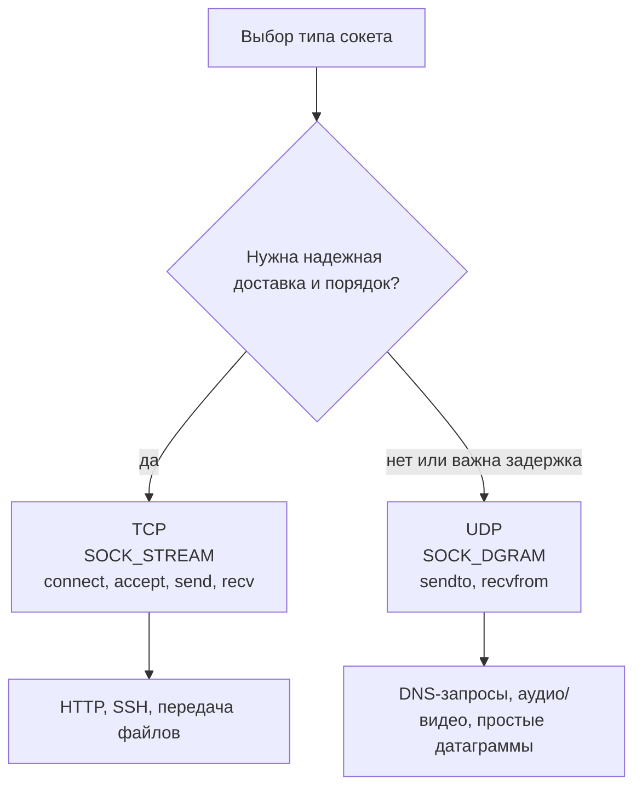

**Краткий ответ**

| Признак | `TCP` | `UDP` |
|---|---|---|
| Соединение | устанавливает соединение | не устанавливает соединение |
| Надежность | контролирует доставку и порядок | не гарантирует доставку |
| Скорость и задержка | обычно больше накладных расходов | обычно меньше накладных расходов |
| Подходит для | файлы, веб-запросы, надежный обмен | видео, голос, быстрые короткие сообщения |

**Объяснение**

- `TCP` сначала устанавливает соединение и следит, чтобы данные дошли корректно.
- `UDP` отправляет датаграммы без подтверждения доставки.
- Если важна полнота и порядок данных, обычно выбирают `TCP`.
- Если важна минимальная задержка и допустимы потери, часто выбирают `UDP`.

**Пример**

- Передача файла: лучше `TCP`.
- Видеозвонок: часто лучше `UDP`, потому что небольшая потеря хуже не делает, а задержка заметна.

**Как ответить на экзамене**

> `TCP` надежнее, потому что устанавливает соединение и контролирует доставку. `UDP` проще и быстрее, но не гарантирует доставку пакетов.

</details>

### 31. Echo-сервер

**Вопрос**

Объясните общий принцип работы echo-сервера, какую роль выполняет клиент, какую роль выполняет сервер, почему такая программа полезна для изучения сетевого программирования.

**Еще один вариант вопроса**

Раскройте учебную ценность echo-сервера, какие элементы сетевого программирования он демонстрирует, как по нему понять роли клиента и сервера.

> **Подумайте:** Покажите роли: клиент отправляет сообщение, сервер возвращает его обратно.

<details>
<summary><strong>Показать ответ и объяснение</strong></summary>

**Схема**

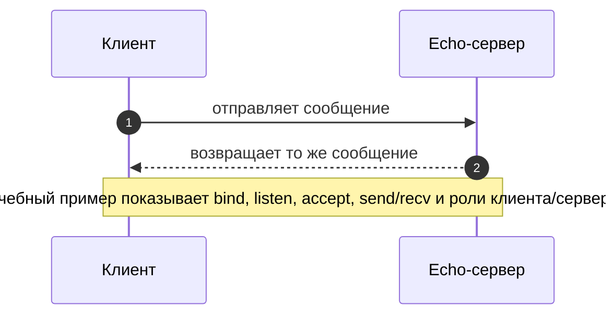

**Краткий ответ**

Echo-сервер принимает сообщение от клиента и возвращает его обратно.

**Объяснение**

- Он показывает базовые элементы сетевого программирования: адрес, порт, подключение, отправку, получение и закрытие соединения.

**Пример**

Клиент отправляет `hello`, сервер отвечает `hello`.

**Как ответить на экзамене**

> Echo-сервер — минимальная модель клиент-серверного обмена.


</details>

### 32. HTTP-запрос

**Вопрос**

Раскройте структуру `HTTP`-запроса, объясните назначение метода, пути, заголовков и тела запроса, поясните, что означает успешный ответ сервера с кодом 200.

**Еще один вариант вопроса**

Разберите `HTTP`-запрос как сообщение клиента к серверу, что означают метод, путь и заголовки, почему код 200 показывает успешную обработку запроса.

> **Подумайте:** Разделите HTTP-сообщение на метод, путь, заголовки, тело и код ответа.

<details>
<summary><strong>Показать ответ и объяснение</strong></summary>

**Схема**

```mermaid
flowchart LR
    C["Клиент / браузер"] --> R1

    subgraph REQ["HTTP-запрос"]
        direction TB
        R1["1. Стартовая строка<br/>GET /index.html HTTP/1.1"]
        R2["2. Заголовки<br/>Host, User-Agent, Accept"]
        R3["3. Пустая строка"]
        R4["4. Тело запроса<br/>обычно есть у POST/PUT"]
        R1 --> R2 --> R3 --> R4
    end

    R4 --> S["Веб-сервер"]
    S --> A1

    subgraph RESP["HTTP-ответ"]
        direction TB
        A1["1. Строка статуса<br/>HTTP/1.1 200 OK"]
        A2["2. Заголовки<br/>Content-Type, Content-Length"]
        A3["3. Пустая строка"]
        A4["4. Тело ответа<br/>HTML, JSON или файл"]
        A1 --> A2 --> A3 --> A4
    end

    A4 --> C

    classDef client fill:#eef2ff,stroke:#4f46e5,color:#111827;
    classDef request fill:#fff7ed,stroke:#ea580c,color:#111827;
    classDef response fill:#ecfdf5,stroke:#059669,color:#111827;
    classDef server fill:#f8fafc,stroke:#334155,color:#111827;
    class C client;
    class R1,R2,R3,R4 request;
    class A1,A2,A3,A4 response;
    class S server;
```

**Краткий ответ**

- `HTTP`-запрос содержит метод, путь, версию протокола, заголовки и иногда тело.
- Метод показывает действие, путь — ресурс, заголовки — служебную информацию.

**Объяснение**

- Код ответа `200` означает успешную обработку запроса.
- Но тело ответа и его смысл зависят от метода и ресурса.

**Пример**

`GET /index.html HTTP/1.1` и заголовок `Host: example.com`.

**Как ответить на экзамене**

> Метод — что сделать, путь — с чем, заголовки — при каких условиях.


</details>

### 33. Путь веб-запроса

**Вопрос**

Объясните, как браузер взаимодействует с веб-сервером, какие этапы проходят от ввода адреса до получения страницы, какую роль играют `DNS`, `TCP` и `HTTP` или `HTTPS`.

**Еще один вариант вопроса**

Опишите путь веб-запроса от браузера до сервера, как имя сайта превращается в IP-адрес, как устанавливается соединение, как клиент получает ответ.

> **Подумайте:** Опишите цепочку: DNS → TCP → TLS при HTTPS → HTTP-запрос → HTTP-ответ.

<details>
<summary><strong>Показать ответ и объяснение</strong></summary>

**Схема**

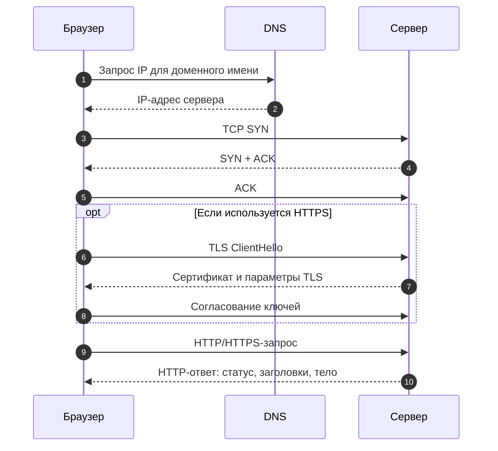

**Краткий ответ**

Браузер узнает IP через `DNS`, устанавливает `TCP`-соединение, при `HTTPS` выполняет TLS-обмен, отправляет `HTTP`-запрос и получает `HTTP`-ответ.

**Объяснение**

- После получения HTML браузер может запросить дополнительные ресурсы: CSS, JavaScript, изображения и шрифты.

**Пример**

`example.com` → `DNS` → IP → `TCP` → TLS → `HTTP` GET → HTML.

**Как ответить на экзамене**

> `DNS` находит адрес, `TCP`/TLS создают канал, `HTTP` передает запрос и ответ.


</details>

## Тема 14. Асинхронность, потоки и процессы

### 34. Процесс и поток

**Вопрос**

Сравните поток и процесс, объясните различия в памяти, изоляции и расходе ресурсов, укажите, как эти различия влияют на обслуживание нескольких сетевых клиентов.

**Еще один вариант вопроса**

Сравните поток и процесс при обслуживании нескольких клиентов, как они используют память, почему выбор подхода зависит от типа нагрузки и требований к изоляции.

> **Подумайте:** Сравните память, изоляцию, стоимость запуска и работу с несколькими клиентами.

<details>
<summary><strong>Показать ответ и объяснение</strong></summary>

**Схема**

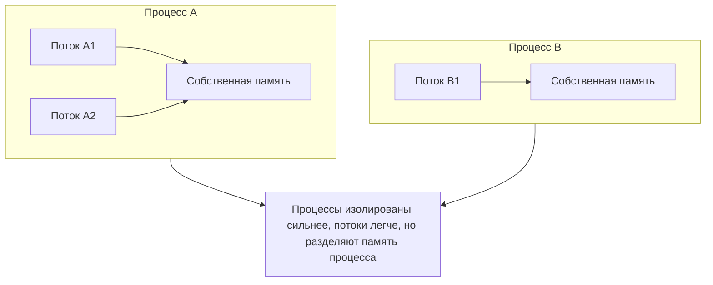

**Краткий ответ**

- Процесс имеет собственную память и сильнее изолирован.
- Поток выполняется внутри процесса и разделяет память с другими потоками этого процесса.

**Объяснение**

- Потоки легче по ресурсам, но требуют аккуратной синхронизации.
- Процессы тяжелее, зато лучше изолируют выполнение и подходят для CPU-bound задач.

**Пример**

Сервер может иметь несколько процессов-воркеров, а внутри них потоки или async-обработку.

**Как ответить на экзамене**

> Потоки легче, процессы изолированнее.


</details>

### 35. GIL

**Вопрос**

Объясните, что такое `GIL` в Python, как он влияет на выполнение потоков, почему ошибки синхронизации могут возникать даже при наличии `GIL`.

**Еще один вариант вопроса**

Объясните влияние `GIL` на многопоточную программу Python, почему потоки полезны для сетевого ввода-вывода, почему общие данные все равно требуют аккуратной синхронизации.

> **Подумайте:** Объясните ограничение выполнения Python bytecode и пользу потоков при I/O-ожидании.

<details>
<summary><strong>Показать ответ и объяснение</strong></summary>

**Схема**

```mermaid
flowchart TB
    P["Процесс Python"] --> GIL["GIL: одновременно исполняется<br/>только один поток Python bytecode"]
    GIL --> T1["Поток 1<br/>выполняет Python-код"]
    GIL --> T2["Поток 2<br/>ждет свою очередь"]
    T1 --> IO["Ожидание сети / диска"]
    IO -. "во время ожидания может работать другой поток" .-> T2
    Shared["Общие данные"] --> Race["Без синхронизации возможна race condition"]
    T1 --> Shared
    T2 --> Shared

    classDef warn fill:#fef2f2,stroke:#dc2626,color:#111827;
    classDef ok fill:#ecfdf5,stroke:#059669,color:#111827;
    class GIL,IO ok;
    class Race warn;
```

**Краткий ответ**

`GIL` в CPython — глобальная блокировка интерпретатора, из-за которой только один поток одновременно выполняет Python-байткод.

**Объяснение**

- Потоки все равно полезны для I/O-bound задач, где программа ждет сеть или диск.
- Но `GIL` не делает общие данные безопасными, поэтому нужны Lock, Queue или другой способ синхронизации.

**Пример**

Два потока без блокировки могут неправильно изменить общий счетчик.

**Как ответить на экзамене**

> `GIL` ограничивает выполнение байткода, но не заменяет синхронизацию.


</details>

### 36. Race condition и deadlock

**Вопрос**

Раскройте понятия race condition и deadlock, объясните причины их появления в многопоточных программах, покажите, почему для решения нужны средства синхронизации.

**Еще один вариант вопроса**

Разберите причины race condition и deadlock в сетевом сервере, какие ошибки проектирования к ним приводят, какие подходы помогают уменьшить риск.

> **Подумайте:** Покажите две разные ошибки: гонка из-за общего ресурса и взаимная блокировка.

<details>
<summary><strong>Показать ответ и объяснение</strong></summary>

**Схема**

```mermaid
flowchart TB
    Start[Многопоточная программа]
    Shared[Общие данные]
    NoLock{Нет правильной синхронизации?}
    Race[Race condition<br/>результат зависит от порядка выполнения]
    L1[Поток 1 держит lock A<br/>и ждет lock B]
    L2[Поток 2 держит lock B<br/>и ждет lock A]
    Dead[Deadlock<br/>оба потока ждут друг друга]

    Start --> Shared --> NoLock
    NoLock -->|да| Race
    Start --> L1 --> Dead
    Start --> L2 --> Dead
```

**Краткий ответ**

- Race condition возникает, когда результат зависит от случайного порядка выполнения потоков или корутин.
- Deadlock возникает, когда участники ждут друг друга и никто не может продолжить работу.

**Объяснение**

- Race condition часто появляется при изменении общих данных без защиты.
- Deadlock часто появляется при неправильном порядке захвата нескольких блокировок.

**Пример**

Поток A держит Lock1 и ждет Lock2, поток B держит Lock2 и ждет Lock1.

**Как ответить на экзамене**

> Минимизируйте общие данные и используйте единый порядок блокировок.


</details>

### 37. Корутины

**Вопрос**

Объясните назначение корутины в Python, где используется асинхронное программирование, почему оно удобно для большого числа операций ожидания ввода-вывода.

**Еще один вариант вопроса**

Объясните назначение корутин в асинхронном сервере, почему они позволяют обслуживать много ожиданий без создания большого числа потоков, где такой подход особенно полезен.

> **Подумайте:** Ключевая идея — не блокировать программу во время ожидания ввода-вывода.

<details>
<summary><strong>Показать ответ и объяснение</strong></summary>

**Схема**

```mermaid
flowchart LR
    Loop[Event loop]
    C1[Корутина 1]
    C2[Корутина 2]
    C3[Корутина 3]
    IO1[ожидание сети]
    IO2[ожидание файла]
    Timer[таймер]

    Loop --> C1 -->|await| IO1 --> Loop
    Loop --> C2 -->|await| IO2 --> Loop
    Loop --> C3 -->|await| Timer --> Loop
    Loop --> Many[Много I/O-ожиданий без создания большого числа потоков]
```

**Краткий ответ**

- Корутина — функция `async def`, которая может приостанавливаться в точках `await`.
- Asyncio позволяет обслуживать много операций ожидания без большого числа потоков.

**Объяснение**

- Это удобно для сетевых серверов, клиентов API, чатов и других I/O-bound задач.
- Event loop переключается между задачами, пока одна из них ждет сеть.

**Пример**

Асинхронный сервер может обслуживать много клиентов, которые большую часть времени ждут данные.

**Как ответить на экзамене**

> Asyncio лучше для ожидания I/O, а не для тяжелых вычислений CPU.


</details>

## Тема 15. Безопасность сетевых приложений

### 38. SSH

**Вопрос**

Объясните назначение `SSH`, какие задачи он решает при администрировании сервера, какие риски возникают при неправильной настройке удаленного доступа.

**Еще один вариант вопроса**

Объясните безопасное использование `SSH` при администрировании Linux-сервера, какие настройки снижают риск несанкционированного доступа, почему парольный вход может быть опасен.

> **Подумайте:** Объясните защищенный удаленный доступ и риск слабой настройки входа.

<details>
<summary><strong>Показать ответ и объяснение</strong></summary>

**Краткий ответ**

- `SSH` нужен для защищенного удаленного администрирования сервера.
- Он шифрует соединение и позволяет выполнять команды на удаленной Linux-системе.

**Объяснение**

- Риски появляются при слабых паролях, открытом root-доступе, отсутствии firewall и устаревших настройках.
- Лучше использовать `SSH`-ключи, ограничивать доступ и регулярно обновлять сервер.

**Пример**

`ssh user@server`.

**Как ответить на экзамене**

> `SSH` дает административный доступ, поэтому его нужно защищать особенно внимательно.


</details>

### 39. SCP

**Вопрос**

Объясните назначение `SCP`, чем он отличается от обычного локального копирования, почему он удобен при работе с удаленным сервером.

**Еще один вариант вопроса**

Опишите применение `SCP` при работе с удаленным сервером, какие файлы удобно передавать таким способом, почему передача должна выполняться по защищенному каналу.

> **Подумайте:** Свяжите SCP с копированием файлов по защищенному SSH-каналу.

<details>
<summary><strong>Показать ответ и объяснение</strong></summary>

**Краткий ответ**

`SCP` копирует файлы между локальным и удаленным компьютером через защищенное `SSH`-соединение.

**Объяснение**

- Это удобно для передачи конфигураций, архивов или небольших файлов на сервер.
- Для больших регулярных синхронизаций часто используют `rsync` или SFTP.

**Пример**

`scp app.tar.gz user@server:/home/user/`.

**Как ответить на экзамене**

> `SCP` — копирование файлов через защищенный канал.


</details>

### 40. Firewall

**Вопрос**

Объясните роль файрвола на сервере, какие задачи решает фильтрация сетевого трафика, почему открывать нужно только необходимые порты.

**Еще один вариант вопроса**

Поясните, почему файрвол является обязательной частью настройки сервера, как принцип минимально необходимых портов снижает риск атаки, какие сервисы обычно требуют открытых портов.

> **Подумайте:** Главная идея — открыть только необходимые порты и закрыть лишний входящий трафик.

<details>
<summary><strong>Показать ответ и объяснение</strong></summary>

**Схема**

```mermaid
flowchart LR
    Internet[Входящий трафик]
    FW{Firewall}
    SSH[SSH<br/>TCP 22]
    HTTP[HTTP<br/>TCP 80]
    HTTPS[HTTPS<br/>TCP 443]
    Closed[Лишние порты закрыты]

    Internet --> FW
    FW -->|разрешено администратору| SSH
    FW -->|разрешено пользователям| HTTP
    FW -->|разрешено пользователям| HTTPS
    FW -. запрет .-> Closed
```

**Краткий ответ**

- Firewall фильтрует сетевой трафик и разрешает только нужные соединения.
- Это уменьшает поверхность атаки.

**Объяснение**

- Если сервис не должен быть доступен извне, его порт не нужно открывать.
- Обычно открывают только 80/443 для сайта и ограниченный `SSH`-доступ для администратора.

**Пример**

Для веб-сайта часто открывают `TCP` 80 и 443.

**Как ответить на экзамене**

> Открытый порт — потенциальная точка входа.


</details>

### 41. Шифрование

**Вопрос**

Сравните симметричное и асимметричное шифрование, объясните различие в ключах, скорости работы и типичных областях применения в сетевой безопасности.

**Еще один вариант вопроса**

Сравните симметричное и асимметричное шифрование в контексте защищенного соединения, почему на практике они часто используются совместно, какую роль играют ключи.

> **Подумайте:** Разделите симметричное шифрование, асимметричное шифрование, сертификаты и TLS.

<details>
<summary><strong>Показать ответ и объяснение</strong></summary>

**Схема**

```mermaid
sequenceDiagram
    autonumber
    participant C as Клиент
    participant S as Сервер
    participant T as Доверенные CA в системе/браузере
    S-->>C: Сертификат сервера с публичным ключом
    Note over C,T: Клиент локально проверяет подпись сертификата<br/>и цепочку доверия по списку доверенных CA
    C->>S: Согласование сеансовых ключей TLS
    Note over C,S: В современных схемах TLS ключ обычно согласуется<br/>через временный обмен ключами, а сертификат подтверждает сервер
    C->>S: Данные, защищенные симметричным сеансовым ключом
    S-->>C: Ответ, защищенный тем же сеансовым ключом
```

**Краткий ответ**

| Вид шифрования | Ключи | Особенность | Где применяется |
|---|---|---|---|
| Симметричное | один общий ключ | быстрое | шифрование большого объема данных |
| Асимметричное | публичный и приватный ключ | удобное для обмена ключами и подписи | `TLS`, сертификаты, цифровая подпись |

**Объяснение**

- В симметричном шифровании один и тот же ключ нужен и для шифрования, и для расшифровки.
- В асимметричном шифровании используется пара ключей: публичный можно раскрывать, приватный нужно хранить в секрете.
- На практике эти подходы часто используют вместе: асимметричный механизм помогает договориться о ключе, а симметричный быстро шифрует данные.

**Как ответить на экзамене**

> Симметричное шифрование быстрее, но требует общего секрета. Асимметричное использует пару ключей и удобно для безопасного обмена и проверки подлинности.

</details>

## Тема 16. Веб-сервер


### 42. Веб-сервер и приложение

**Вопрос**

Объясните назначение веб-сервера, чем он отличается от веб-приложения, почему в реальных системах часто используют отдельный веб-сервер перед приложением.

**Еще один вариант вопроса**

Сравните веб-сервер и серверное приложение, какие функции может взять на себя `Nginx`, почему приложение не всегда публикуют напрямую в Интернет.

> **Подумайте:** Различайте веб-сервер, приложение, статические файлы и проксирование запроса.

<details>
<summary><strong>Показать ответ и объяснение</strong></summary>

**Схема**

```mermaid
flowchart LR
    B[Браузер]
    WS[Веб-сервер<br/>Nginx или Apache]
    Static[Статические файлы<br/>HTML, CSS, JS, изображения]
    App[Веб-приложение<br/>например Flask]
    Data[Данные и бизнес-логика]

    B -->|HTTP/HTTPS запрос| WS
    WS -->|отдать как есть| Static
    WS -->|передать динамический запрос| App
    App --> Data
    Data --> App --> WS --> B
```

**Краткий ответ**

- Веб-сервер принимает `HTTP`-запросы и возвращает ответы или передает запрос приложению.
- Веб-приложение содержит логику: маршруты, обработку данных, шаблоны и работу с базой.

**Объяснение**

- В реальных системах приложение часто не публикуют напрямую.
- Перед ним ставят `Nginx` или `Apache` для TLS, статических файлов, логов, лимитов и проксирования.

**Пример**

`Nginx` принимает запрос, `Flask` формирует динамический ответ.

**Как ответить на экзамене**

> Веб-сервер — входная точка `HTTP`, приложение — логика ответа.


</details>

### 43. Виртуальный хост

**Вопрос**

Раскройте понятие виртуального хоста в `Nginx`, объясните, зачем он нужен, покажите, как один сервер может обслуживать несколько сайтов.

**Еще один вариант вопроса**

Объясните использование виртуальных хостов для нескольких сайтов, как сервер понимает, какой сайт нужно открыть, почему это удобно при размещении разных доменов.

> **Подумайте:** Подумайте о заголовке Host: по нему один сервер выбирает нужный сайт.

<details>
<summary><strong>Показать ответ и объяснение</strong></summary>

**Схема**

```mermaid
flowchart TB
    Req[HTTP-запрос<br/>Host: site-b.example]
    Web[Nginx / Apache]
    A[server block: site-a.example]
    B[server block: site-b.example]
    C[server block: site-c.example]

    Req --> Web
    Web -->|Host = site-a.example| A
    Web -->|Host = site-b.example| B
    Web -->|Host = site-c.example| C
```

**Краткий ответ**

- Виртуальный хост позволяет одному серверу обслуживать несколько сайтов или доменов.
- `Nginx` выбирает нужную конфигурацию по имени хоста и `server_name`.

**Объяснение**

- Для каждого сайта можно задать свой каталог, сертификат, правила проксирования и журналы.

**Пример**

Один IP может обслуживать `site1.example.com` и `site2.example.com`.

**Как ответить на экзамене**

> Виртуальный хост отвечает: какой сайт открыть на этом сервере?


</details>

### 44. Reverse proxy

**Вопрос**

Объясните роль обратного прокси, почему `Nginx` часто ставят перед `Flask`-приложением, какие задачи он может выполнять помимо простой передачи запросов.

**Еще один вариант вопроса**

Поясните роль обратного прокси в промышленной схеме развертывания, как он связан с безопасностью, статическими файлами и распределением запросов.

> **Подумайте:** Покажите, почему Nginx ставят перед приложением: TLS, статика, логи, проксирование.

<details>
<summary><strong>Показать ответ и объяснение</strong></summary>

**Схема**

```mermaid
flowchart LR
    U["Клиент<br/>браузер"] --> N["Nginx<br/>:80 / :443"]
    N -->|статические файлы| Static["HTML / CSS / изображения"]
    N -->|динамические запросы| App["Flask / Gunicorn<br/>127.0.0.1:8000"]
    App --> DB["База данных / файлы"]
    N -. "TLS, кэш, лимиты, заголовки" .-> U

    classDef edge fill:#eef2ff,stroke:#4f46e5,color:#111827;
    classDef proxy fill:#fff7ed,stroke:#ea580c,color:#111827;
    classDef app fill:#ecfdf5,stroke:#059669,color:#111827;
    class U edge;
    class N proxy;
    class Static,App,DB app;
```

**Краткий ответ**

Reverse proxy принимает запросы от клиентов и передает их внутреннему серверу приложения, например `Gunicorn` с `Flask`.

**Объяснение**

- `Nginx` может обрабатывать `HTTPS`, статические файлы, лимиты, логи, балансировку и скрывать внутренний порт приложения.

**Пример**

`Nginx` слушает 443, а запросы к `Flask` передает на `127.0.0.1:8000`.

**Как ответить на экзамене**

> Reverse proxy — внешний вход к внутреннему приложению.


</details>

### 45. Статический и динамический контент

**Вопрос**

Объясните различие между статическим и динамическим веб-контентом, приведите примеры каждого типа, покажите, почему веб-серверу важно уметь обслуживать оба варианта.

**Еще один вариант вопроса**

Сравните статическую HTML-страницу и страницу, сформированную приложением, какие данные меняются, как веб-сервер и приложение участвуют в обработке.

> **Подумайте:** Сравните файл, который отдается как есть, и страницу, которую формирует приложение.

<details>
<summary><strong>Показать ответ и объяснение</strong></summary>

**Краткий ответ**

- Статический контент — готовые файлы, которые отдаются как есть.
- Динамический контент формируется приложением во время запроса.

**Объяснение**

- Веб-сервер быстро отдает статические файлы.
- Динамические страницы часто требуют выполнения кода и обращения к базе данных.

**Пример**

- `style.css` — статический файл.
- Личный кабинет пользователя — динамический ответ.

**Как ответить на экзамене**

> Статический файл уже готов, динамический ответ создается программой.


</details>

### 46. Flask

**Вопрос**

Объясните назначение `Flask` в разработке серверных приложений, какие задачи он упрощает, почему его удобно использовать для учебного веб-сервера.

**Еще один вариант вопроса**

Объясните, почему `Flask` подходит для создания простого серверного приложения, какие основные элементы включает `Flask`-приложение, как оно отвечает на `HTTP`-запросы.

> **Подумайте:** Назовите маршруты, обработку HTTP-запросов и формирование ответа приложением.

<details>
<summary><strong>Показать ответ и объяснение</strong></summary>

**Краткий ответ**

- `Flask` — легкий Python-фреймворк для создания веб-приложений.
- Он быстро показывает основные идеи: `route`, request, response, шаблоны и обработку `HTTP`.

**Объяснение**

- Для учебы он прост и понятен.
- Для production его обычно запускают не встроенным dev-сервером, а через `WSGI`-сервер, например `Gunicorn`, за `Nginx`.

**Пример**

`@app.route("/")` связывает URL с функцией Python.

**Как ответить на экзамене**

> `Flask` помогает понять логику приложения, но не заменяет production-схему развертывания.


</details>

## Тема 17. Развертывание приложений


### 47. Docker-контейнеры

**Вопрос**

Раскройте назначение `Docker`-контейнеров, какие проблемы совместимости они решают, почему контейнеризация полезна при развертывании серверных приложений.

**Еще один вариант вопроса**

Поясните, как `Docker` помогает одинаково запускать `Flask`-приложение на разных компьютерах, какие элементы окружения попадают в контейнер, почему это удобно для развертывания.

> **Подумайте:** Свяжите код, зависимости, образ, контейнер и открытый порт приложения.

<details>
<summary><strong>Показать ответ и объяснение</strong></summary>

**Схема**

```mermaid
flowchart LR
    Code[Код приложения]
    DF[Dockerfile]
    Image[Docker image<br/>неизменяемый шаблон]
    Container[Container<br/>запущенный экземпляр]
    Port[Порт приложения]

    Code --> DF
    DF -->|docker build| Image
    Image -->|docker run| Container
    Container --> Port
```

**Краткий ответ**

- `Docker` упаковывает приложение и окружение в образ, из которого запускается контейнер.
- Внутри фиксируются зависимости, рабочая директория и команда запуска.

**Объяснение**

- Это уменьшает проблему «у меня работает, а на сервере нет».
- Если образ собран правильно, его можно запускать на разных машинах примерно одинаково.

**Пример**

Образ может содержать Python, зависимости из `requirements.txt`, код `Flask` и команду запуска `Gunicorn`.

**Как ответить на экзамене**

> `Docker` делает окружение приложения более повторяемым.


</details>

### 48. Контейнер и виртуальная машина

**Вопрос**

Сравните контейнер и виртуальную машину на концептуальном уровне, объясните различия в изоляции, запуске и потреблении ресурсов, укажите, когда контейнер удобнее.

**Еще один вариант вопроса**

Сравните контейнер и виртуальную машину при размещении серверного приложения, какие ресурсы они используют, почему контейнер обычно запускается быстрее.

> **Подумайте:** Сравните общее ядро контейнера и отдельную гостевую ОС виртуальной машины.

<details>
<summary><strong>Показать ответ и объяснение</strong></summary>

**Схема**

```mermaid
flowchart TB
    subgraph VM[Виртуальная машина]
        VMApp[Приложение]
        Guest[Гостевая ОС]
        Hyper[Гипервизор]
        VMApp --> Guest --> Hyper
    end
    subgraph CNT[Контейнер]
        CApp[Приложение]
        Deps[Зависимости]
        Kernel[Общее ядро хоста]
        CApp --> Deps --> Kernel
    end
    VMNote[Больше изоляции, больше ресурсов]
    CNote[Быстрый запуск, меньше ресурсов]
    VM --> VMNote
    CNT --> CNote
```

**Краткий ответ**

| Признак | Контейнер | Виртуальная машина |
|---|---|---|
| Что изолирует | приложение и его окружение | целую гостевую ОС |
| Запуск | обычно быстрее | обычно медленнее |
| Ресурсы | потребляет меньше | потребляет больше |
| Когда удобнее | развертывание приложений | сильная изоляция разных ОС |

**Объяснение**

- Контейнер использует ядро основной системы и изолирует процессы приложения.
- Виртуальная машина запускает отдельную гостевую операционную систему.
- Для учебного серверного приложения контейнер часто проще и легче.

**Как ответить на экзамене**

> Контейнер легче виртуальной машины, потому что не запускает полноценную гостевую ОС. Поэтому он удобен для повторяемого развертывания приложений.

</details>

### 49. Dockerfile

**Вопрос**

Объясните назначение `Dockerfile` при развертывании приложения, почему описание окружения в файле делает запуск более повторяемым, какую роль играют зависимости и сетевой порт.

**Еще один вариант вопроса**

Поясните назначение `Dockerfile` для учебного веб-приложения, какие сведения о среде он фиксирует, почему это делает запуск приложения более предсказуемым.

> **Подумайте:** Покажите путь от инструкций Dockerfile к образу и запущенному контейнеру.

<details>
<summary><strong>Показать ответ и объяснение</strong></summary>

**Схема**

```mermaid
flowchart TB
    D["Dockerfile<br/>инструкции окружения"] --> B["docker build<br/>создание образа"]
    B --> I["Docker image<br/>готовый шаблон приложения"]
    I --> R["docker run<br/>запуск контейнера"]
    R --> C["Container<br/>изолированный процесс приложения"]
    C --> P["Публикация порта<br/>например host:80 → container:8000"]
    C --> E["Переменные окружения<br/>настройки без изменения кода"]

    classDef file fill:#eef2ff,stroke:#4f46e5,color:#111827;
    classDef build fill:#fff7ed,stroke:#ea580c,color:#111827;
    classDef run fill:#ecfdf5,stroke:#059669,color:#111827;
    class D file;
    class B,I build;
    class R,C,P,E run;
```

**Краткий ответ**

`Dockerfile` — текстовый файл с инструкциями для создания `Docker`-образа: базовый образ, рабочая директория, копирование файлов, установка зависимостей и команда запуска.

**Объяснение**

- Он превращает ручную настройку сервера в воспроизводимое описание.
- В `Dockerfile` обычно фиксируют базовый образ, рабочую директорию, копирование файлов, установку зависимостей и команду запуска.
- `EXPOSE` документирует порт приложения внутри контейнера, а публикация порта наружу обычно задается при запуске контейнера, например `-p 80:8000`.

**Пример**

```dockerfile
FROM python:3.12-slim
WORKDIR /app
COPY requirements.txt .
RUN pip install -r requirements.txt
COPY . .
CMD ["python", "app.py"]
```

**Как ответить на экзамене**

> `Dockerfile` описывает, как собрать повторяемое окружение приложения: базовый образ, зависимости, файлы проекта, команду запуска и порт приложения.


</details>

### 50. Переменные окружения

**Вопрос**

Объясните, зачем при развертывании приложения нужны переменные окружения, какие настройки обычно выносят из кода, почему это повышает безопасность и переносимость.

**Еще один вариант вопроса**

Объясните роль переменных окружения при развертывании серверного приложения, какие параметры нельзя жестко записывать в код, как это связано с безопасностью.

> **Подумайте:** Объясните, почему настройки, порты и секреты лучше не записывать жестко в код.

<details>
<summary><strong>Показать ответ и объяснение</strong></summary>

**Схема**

```mermaid
flowchart LR
    Env[Переменные окружения]
    Config[Настройки<br/>режим, host, port]
    Secrets[Секреты<br/>пароли, токены]
    Deploy[Разные среды<br/>dev, test, production]
    App[Один код приложения]

    Env --> Config
    Env --> Secrets
    Env --> Deploy
    Config --> App
    Secrets --> App
    Deploy --> App
```

**Краткий ответ**

- Переменные окружения позволяют менять настройки приложения без изменения кода.
- В них часто выносят адрес базы данных, режим запуска, порт, секретный ключ и токены. При этом секреты в переменных окружения тоже нужно защищать: не печатать в логах и не публиковать в репозитории.

**Объяснение**

- Один и тот же код можно запускать в учебной, тестовой и production-среде с разными настройками.
- Секреты нельзя жестко записывать в код и публиковать в репозитории.

**Пример**

`DATABASE_URL`, `SECRET_KEY`, `PORT`, `FLASK_ENV`.

**Как ответить на экзамене**

> Код должен быть общим, настройки среды — внешними.


</details>
